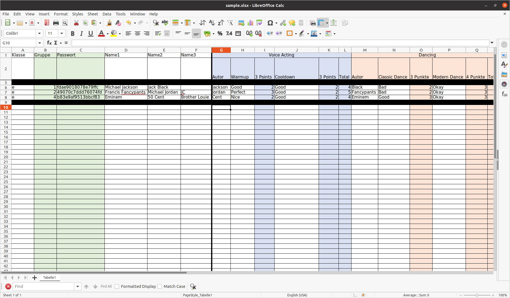
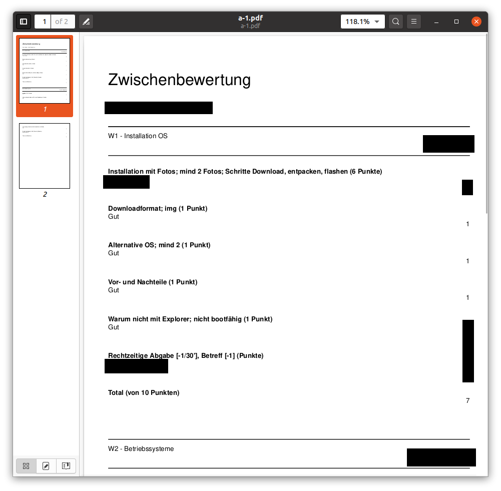

# BBZ grading script

This script can be used to generate PDF files from a grading grid.

See the file `samples/sample.xlsx` for an example.

Some important parts:

* Column 1 and 2 must contain the Class and Group name
* Col 3 is used to protect the resulting sheets. Each sheet will be protected with the password mentioned there
* Col 4-6 are used for the author names

Those columns are followed by the actual topics, of which there can be any number. They contain the following information:

* Col 1 is the name of the author, used to match the topics to the group members
* Col [2,3], [4,5], [6,7]... are the grading comment and the number of points awarded for each part
* The last column is the total number of points

To generate the PDF, run the `app.rb` file. This will create a PDF for each line in the `output` folder, each file protected by the password from column 3.

